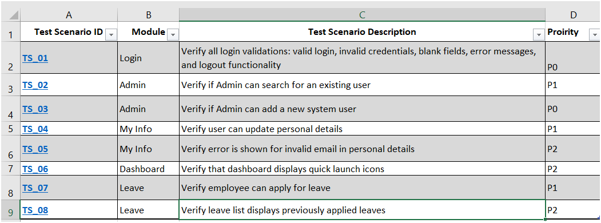
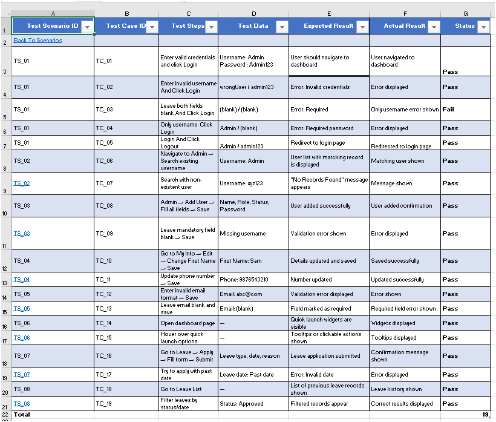
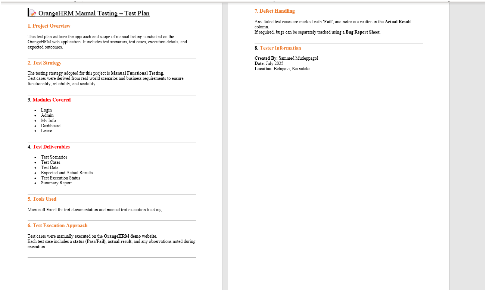

# OrangeHRM Manual Testing Project

📁 **Project Name**: OrangeHRM  
🧑‍💻 **Created By**: Sammed Mudeppagol  
📅 **Date**: July 2025  
📍 **Type**: Manual Testing  
🛠 **Tool Used**: Excel

## 📌 Project Overview
This is a complete manual testing project done on the OrangeHRM web application. It includes:

- Test Plan (basic)
- Test Scenarios
- Detailed Test Cases
- Status (Pass/Fail)
- Real test data
- Hyperlinked navigation between sheets

---

## 📄 Included Documents

| File | Description |
|------|-------------|
| `OrangeHRM Report.xlsx` | Main test documentation (with hyperlinks) |
| `TestPlan.txt` | Overview of modules, strategy, tools |
| `README.md` | Project summary for GitHub |

---

## ✅ Test Coverage
- 🔐 Login Functionality
- 🧑 Admin Module
- 🧾 My Info
- 📅 Leave Application
- 📊 Dashboard & Widgets

---

## 💡 Highlights
- Manual Testing Only
- Includes Positive & Negative Test Cases
- Clear Expected vs Actual Results
- Priority Tagging (P0/P1)
- Filterable Execution Tracker (optional)

---

## 👨‍💻 About Me
Sammed Mudeppagol – BCA Graduate  
Actively applying for QA roles  
Available to join within 15 days  
Open to Bengaluru & Pune locations  

---

## 🖼️ Screenshots Preview

### ✅ Test Scenarios Sheet

### ✅ Test Cases Sheet

### ✅ Test Plan (Preview)

---

## 📬 Contact

📧 Email: mdsammed07@gmail.com  
📱 Mobile: 9380660527  
🔗 LinkedIn: [linkedin.com/in/sammedmudeppagol](https://www.linkedin.com/in/sammedmudeppagol)
📍 Location: Belagavi, Karnataka
